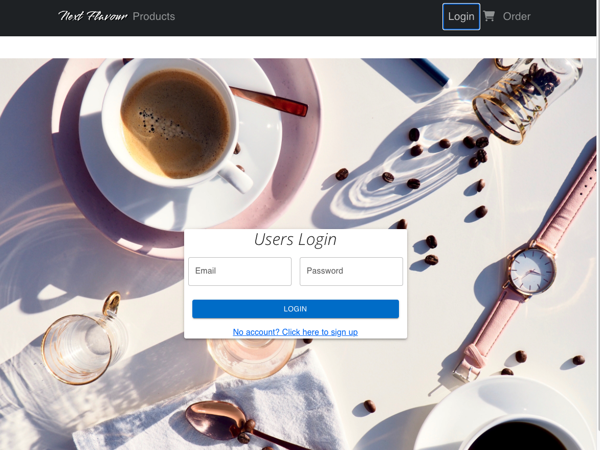
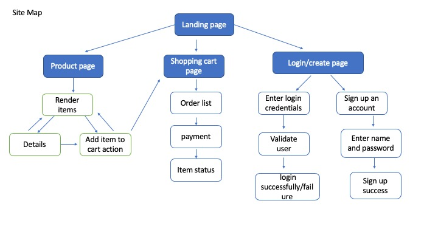
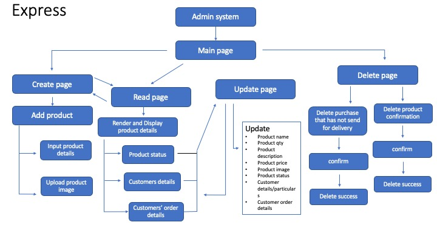

# Bean-Flavour

   

## Project Summary

**Project Context**

Bean Flavour is a mobile-responsive Ecommerce web application that allows users to purchase local sg branded flavour coffee bean. Users can sign up account with Bean-flavour coffee, add items to chart, checkout item and do online payment. 

**Organisational Goals**

The app aims to promote local brand coffee products and provide service that allows users to search and purchase. For the product owner, it would be a system for them to keep track of item stocks, number of purchases and transaction history.

**User Goals**

Able to look for the desire coffee products, order, add to cart and online payment.

## UI/UX

### **Strategy**

_Organisation_
* objective: display coffee products catalogue, allow to user to purchase products made by the organsation from online store and make profit out from it

_User_
* objective: search coffee products that suits the user, able to order and purchase items from the online store.

_Pain Point_
* unable to find high quality, certified coffee bean or coffee products that are made by local brands in the market

User stories | Acceptance Criteria
-------------|--------------------
As a user, I would like to see all the available product name, price and image, so that I know what are product that I can purchase from the web store. | retrieve product information from database
As a user, I want the website to be able to search products by name, type etc, so that I will only retrieve product information that are only related to my search input. | search feature
As a user, I would like to do payment online and through credit card, so that I do not require to do payment in cheque or cash | feature that allows payment to be make online
As a user, I would like to see my cart item, so that I can know what are the items that I have added to the shopping cart | feature that can display can display cart items
As a user, I would like to see my purchase history, so that I can know what are the items I have purchased and how much money I spent | feature that can display the shopping/purchase history 

### **Scope**
_Functional Specifications_

* Able to search for coffee products by name, type and price etc

* Able to add item to cart

* Able to place order

* Able to make payment online

_Non-functional requirments_ 
* Mobile responsiveness

* Performance

### **Structure**

* The following is the next-flavour coffee application structure diagram

 
 

### **Skeleton**

Wireframes for mobile, desktop version

[https://henry358751.invisionapp.com/homepage?tid=10386126](https://henry358751.invisionapp.com/homepage?tid=10386126)

### **Surface**

